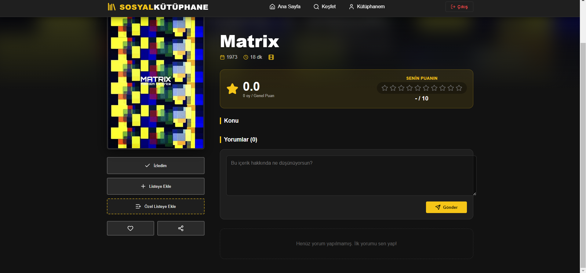
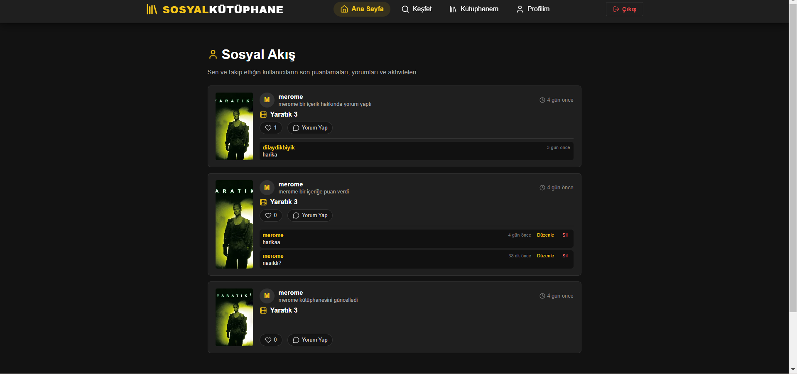
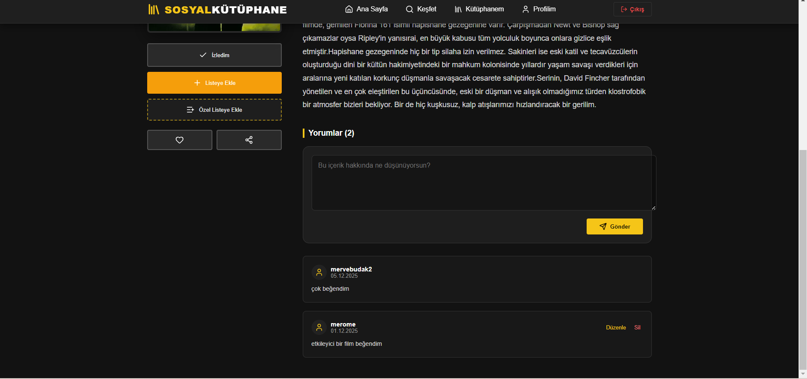
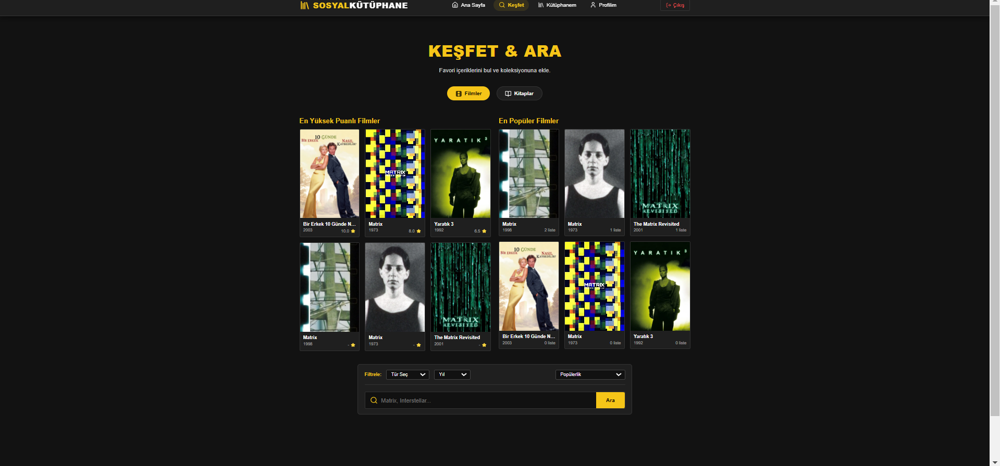

<div align="center">
  
  <h1>Sosyal Kütüphane Platformu</h1>
  <p>
    <b>Web Tabanlı Sosyal Kitap ve Film Kütüphanesi Platformu</b><br>
    <i>Next-generation platform for discovering, tracking, and socializing over books and movies.</i>
  </p>
</div>

---

## 📖 Proje Hakkında (About The Project)

**Sosyal Kütüphane Platformu**, kullanıcıların okudukları kitapları ve izledikleri filmleri takip edebilmelerini, yeni içerikler keşfedebilmelerini ve diğer kullanıcılarla etkileşime geçebilmelerini sağlayan interaktif bir web platformudur. Kocaeli Üniversitesi Yazlab Proje 2 kapsamında geliştirilmiş olup, modern web teknolojilerini ve gelişmiş dış API entegrasyonlarını barındırır.

Kullanıcılar platform üzerinde:
- **TMDb (The Movie Database) API** üzerinden en güncel film ve dizileri keşfedebilir.
- **Google Books API** sayesinde dünya çapındaki devasa kitap arşivlerinde arama yapabilir.
- İçerikleri kendi "Kütüphanem" veya "Özel Listeler" kısmına ekleyip kişisel takiplerini sürdürebilirler.
- Diğer kullanıcıların profillerini inceleyip **takip edebilir**, paylaştıkları içeriklere **yorum yapabilir** ve **1-10 arası puan** verebilirler.

## 🚀 Özellikler (Features)

*   🔐 **Gelişmiş Kimlik Doğrulama:** Supabase üzerinden güvenli kayıt, giriş ve oturum yönetimi.
*   🔍 **Kapsamlı İçerik Keşfi:** Google Books ve TMDb entegrasyonu ile milyonlarca filme ve kitaba anında erişim. Kategori (Tür) ve Yıl (Decade) bazında dinamik filtreleme ve sayfalama.
*   📚 **Kişisel Kütüphane:** İzlenenleri ve okunanları ayrı listelerde tutabilme yeteneği. İsteğe bağlı özel listeler oluşturma.
*   👥 **Sosyal Ağ Dinamikleri:** 
    *   Kullanıcıları takip etme & takipçi sistemi.
    *   Aktivite akışı (Son Yorumlar, Puanlamalar, Listeye Eklenenler).
    *   Yorumlara ve aktivitelere "Beğeni (Like)" atabilme sistemi.
*   ⭐️ **Değerlendirme Sistemi:** İçeriklere detaylı puan verme ve interaktif inceleme (review) yazabilme.

<br>

## 📸 Ekran Görüntüleri (Screenshots)

### 🏠 Ana Sayfa (Home) & Genel Bakış
Kullanıcının platforma giriş yaptıktan sonra karşılaştığı, dinamik içeriklerin yer aldığı modern dashboard görünümü.


### 🔎 Keşfet ve Gelişmiş Filtreleme (Discover)
TMDb ve Google Books verilerinin çekildiği, detaylı filtrelerin (on yıl, tür, arama çubuğu) bulunduğu arama motoru arayüzü.


### ℹ️ İçerik Detay Sayfası (Content Details)
Film veya kitapların kapak fotoğraflarını, detaylı özetlerini ve diğer kullanıcıların bıraktığı değerlendirmeleri/yorumları gösteren sayfa.


### 👤 Profil & Etkileşimler (Profile & Socials)
Kullanıcının kişisel istatistiklerini (takipçi vs.), puanlarını, yazdığı yorumlarını ve son eylemlerini listelediği kapsamlı profil görünümü.


---

## 🛠️ Teknolojiler (Tech Stack)

### Frontend
- **React.js** (v18.x) - UI Library
- **React Router DOM** (v6.x) - Client-side Routing
- **Lucide React** - Modern SVG Icons
- **Vanilla CSS** - Tamamen özelleştirilmiş, duyarlı (responsive) modern "Dark Theme" tasarımı

### Backend & Database
- **Supabase** (PostgreSQL) - Tam kontrollü BAAS tabanlı ilişkisel veritabanı.
- **SQL Triggers & Functions** - Veri tutarlılığı ve iş kuralları için veritabanı seviyesinde yazılmış gelişmiş SQL tetikleyicileri (`trigger.sql`, `ekstra.sql`).

### External APIs (Dış API'ler)
- **TMDb (The Movie Database) API (v3)** - Film/Dizi metadataları, afişler ve keşif fonksiyonları.
- **Google Books API** - Kitap metadataları, yazar ve sayfa sayısı bilgileri.

---

## ⚙️ Kurulum ve Çalıştırma (Installation & Setup)

Projeyi yerel bilgisayarınızda (local environment) çalıştırmak için aşağıdaki adımları izleyin:

1. **Repoyu Klonlayın**
   ```bash
   git clone https://github.com/mervebudakk/sosyal-kutuphane-platformu.git
   cd sosyal-kutuphane-platformu
   ```

2. **Frontend Bağımlılıklarını Yükleyin**
   ```bash
   cd frontend
   npm install
   ```

3. **Çevresel Değişkenleri (Environment Variables) Ayarlayın**
   `frontend` kök dizininde bir `.env` dosyası oluşturun ve aşağıdaki değerleri kendi anahtarlarınızla değiştirin:
   ```env
   REACT_APP_SUPABASE_URL=your_supabase_project_url
   REACT_APP_SUPABASE_ANON_KEY=your_supabase_anon_key
   REACT_APP_TMDB_API_KEY=your_tmdb_api_key
   ```

4. **Projeyi Başlatın**
   ```bash
   npm start
   ```
   Uygulama `http://localhost:3000` adresinde çalışmaya başlayacaktır.

## 🗄️ Veritabanı Kurulumu (Database Setup)
Eğer kendi veritabanınızı Supabase üzerinde sıfırdan kurmak isterseniz proje içerisindeki SQL dosyalarını kullanabilirsiniz:
1. Supabase SQL Editor üzerinden `veritabani.sql` dosyasındaki kodları çalıştırın (tablo oluşumları).
2. Daha sonra `trigger.sql` ve `ekstra.sql` içerisindeki fonksiyonları çalıştırarak otomasyonları sağlayın.

---
> Geliştiriciler: *[Merve Budak](https://github.com/mervebudakk)*
